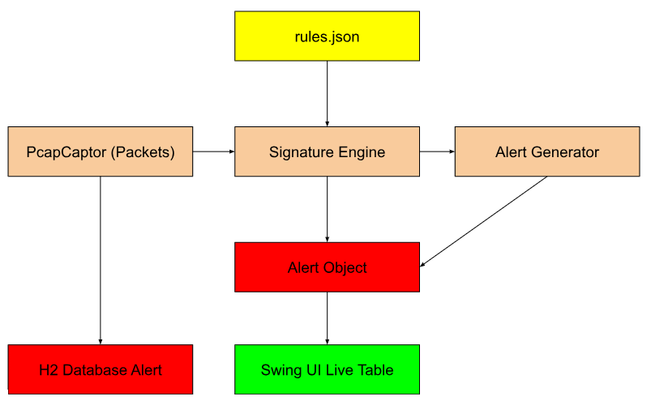

# NetGuard-IDS --- Complete Documentation

NetGuard-IDS is a lightweight Java-based Intrusion Detection System
(IDS) featuring real-time packet capture, signature-based detection,
alert logging, an interactive Swing GUI dashboard, and persistent H2
database storage.

------------------------------------------------------------------------

# 1. Introduction

NetGuard-IDS is a simplified IDS similar to Snort/Suricata.
It captures packets from a selected network interface, analyzes them
using signature rules, logs alerts, and displays them live in a
user-friendly GUI.
It is ideal for learning, research, academic submissions, and security
demonstrations.

------------------------------------------------------------------------

# 2. Objective

-   Capture live network packets
-   Detect suspicious activity based on signatures
-   Generate alerts for rule matches
-   Store alerts persistently
-   Display alerts in a real-time GUI
-   Export alerts for further analysis

------------------------------------------------------------------------

# 3. Key Features

-   ✔ Real-time network packet capture
-   ✔ Signature-based detection engine
-   ✔ Alerts saved in H2 database
-   ✔ Live Swing dashboard
-   ✔ CSV exporting
-   ✔ Modular and extendable codebase

------------------------------------------------------------------------

# 4. Architecture Overview

------------------------------------------------------------------------

# 5. Project Modules

### 5.1 PcapCaptor

-   Captures network packets
-   Extracts IP, ports, payload
-   Forwards packets to SignatureEngine

### 5.2 SignatureEngine

-   Receives list of rules
-   Matches packets with patterns
-   Generates alerts

### 5.3 Rule Model

Represents a detection rule with:

-   id
-   name
-   pattern
-   srcPort
-   dstPort

### 5.4 Alert Model

Contains:

-   ID
-   Rule ID
-   Rule name
-   Source/Destination info
-   Timestamp
-   Payload snippet


### 5.6 Swing UI

-   Displays real-time alerts in table
-   Allows CSV export

------------------------------------------------------------------------

# 6. Main Program Flow (IDSDashboard.java)

1.  Parse network interface from program argument
2.  Load rules from `rules.json`
3.  Initialize SignatureEngine
4.  Start Swing GUI
5.  Begin packet capture
6.  Display and store alerts
7.  Graceful shutdown

------------------------------------------------------------------------

# 7. Rules Format Documentation (rules.json)

Example:

``` json
[
  {
    "id": 10,
    "name": "Suspicious HTTP Keyword",
    "pattern": "malware",
    "srcPort": 0,
    "dstPort": 80
  }
]
```

-   `pattern` is matched inside payload
-   Ports = 0 means "ignore port"

------------------------------------------------------------------------

# 8. Database Schema

  

------------------------------------------------------------------------

# 9. GUI Documentation

### GUI Features:

-   JTable showing:
    `ID | Rule ID | Rule Name | Src IP | Src Port | Dst IP | Dst Port | Timestamp | Snippet`
-   Auto-sorting enabled
-   Export CSV button

------------------------------------------------------------------------

# 10. Installation Instructions

### Requirements:

-   Java 17 or above
-   Maven
-   PCAP library:
    -   Windows → npcap
    -   Linux → libpcap

------------------------------------------------------------------------

# 11. Build Instructions

    mvn clean package

Output JAR:

    target/netguard-ids.jar

------------------------------------------------------------------------

# 12. Running the Program

Linux:

    ip link show

Windows:
Use npcap interface list.

Run IDS:

    java -jar netguard-ids.jar eth0

------------------------------------------------------------------------

# 13. CSV Export

GUI → "Export CSV" button saves file to:

    ~/netguard_alerts_export.csv

------------------------------------------------------------------------

# 14. Packet Capturing Workflow

1.  Open NIC in promiscuous mode
2.  Capture packets continuously
3.  Parse IP, ports, payload
4.  Send payload to SignatureEngine
5.  Trigger alert on match

------------------------------------------------------------------------

# 15. Signature Engine Workflow

1.  Receive payload
2.  Loop rules
3.  Check port match
4.  Check pattern match
5.  Create alert
6.  Add to DB + GUI

------------------------------------------------------------------------

# 16. Future Enhancements

-   Severity levels for rules
-   Regex-based rule matching
-   Snort-rule compatibility
-   Protocol-based filters
-   Real-time charts
-   REST API for alert retrieval
-   Auto rule updates
-   TLS fingerprinting

------------------------------------------------------------------------
